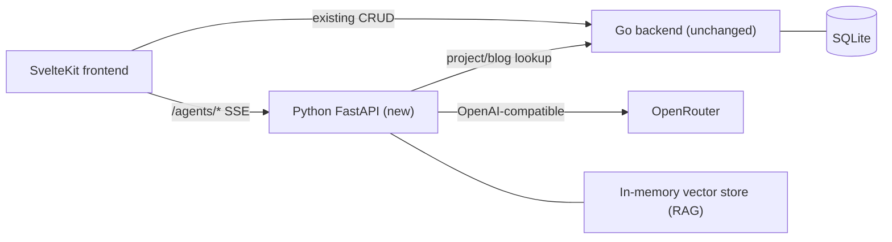

# Portfolio Revamp + Oracles

Working document tracking the multi-phase plan to evolve the Legacy Folio
portfolio and add four agentic bots ("The Oracles") that showcase applied
AI engineering.

- **Branch:** `feat/portfolio-revamp-oracles`
- **First commit:** `2a1ae70` &mdash; *Revamp portfolio UI and scaffold Oracles agentic bots*
- **Status:** UI revamp shipped; bot implementations paused per user request

---

## Goals

- Evolve, not replace, the "Legacy Folio" classical aesthetic (mahogany /
  parchment / brass, Playfair Display + PT Serif).
- Introduce a new section, "The Oracles" &mdash; agentic bots styled as
  illuminated counsel inside the archive.
- Showcase AI engineering: streaming, tool use, RAG, multi-agent
  orchestration &mdash; via a new Python FastAPI sidecar using OpenRouter.

---

## Final architecture



Top-level layout:

```
portfolio/
  frontend/   SvelteKit + Tailwind
  backend/    Go + Gorilla + SQLite (existing)
  agents/     Python FastAPI sidecar (new)
```

---

## The four Oracles

| #   | Name                       | Discipline                | Demonstrates                                          |
| --- | -------------------------- | ------------------------- | ----------------------------------------------------- |
| I   | Portfolio Concierge        | Retrieval-Augmented       | sentence-transformers RAG over resume/projects/blog   |
| II  | Patent Compliance Bench    | Multi-agent (LangGraph)   | Drafter -> Reviewer -> Revisor with critique loop     |
| III | Project Tour Guide         | Tool-using agent          | OpenRouter tool-calling against the Go backend        |
| IV  | Clause Explainer           | Structured JSON output    | Pydantic-validated single-shot generation             |

Visitor sessions are in-memory only (no login, no DB persistence). A session
id cookie scopes chat history; sessions are evicted after idle TTL. Each bot
page is intended to include "Try a sample" buttons; the Patent bot will show
a privacy banner: do not paste real confidential drafts.

---

## Phasing and status

### Phase 0 &mdash; Foundations (DONE)

- [x] **phase0_resume_extract** &mdash; Extract resume from `+page.svelte` into
  [frontend/src/lib/content/resume.ts](../frontend/src/lib/content/resume.ts);
  add Go `GET /api/resume` handler at
  [backend/internal/api/resume.go](../backend/internal/api/resume.go) reading
  [backend/data/resume.json](../backend/data/resume.json).
- [x] **phase0_agents_scaffold** &mdash; Python FastAPI service in `agents/`
  with OpenRouter client, SSE helpers, session store, rate limiter,
  Dockerfile, docker-compose entry, `.env.example`.
- [x] **phase0_frontend_scaffold** &mdash; Shared `OracleChat` +
  `ToolCallTrace` components, `/oracles` landing page, Navbar entry,
  oracle CSS utilities in `app.css`.

### Phase 1 &mdash; Two flagship bots (CANCELLED &mdash; bot logic deferred)

- [ ] ~~**phase1_concierge** &mdash; Portfolio Concierge: local
  `sentence-transformers` RAG index over resume/projects/blog,
  `POST /agents/concierge/chat` SSE endpoint, citation UI.~~
- [ ] ~~**phase1_patent_multiagent** &mdash; Patent Compliance multi-agent
  (LangGraph: drafter -> reviewer -> revisor) with structured
  `ComplianceReport` pydantic model, `POST /agents/patent/run` SSE endpoint,
  three-panel UI with timeline + memorandum + sample drafts + disclaimer.~~

### Phase 2 &mdash; Remaining two bots (CANCELLED &mdash; bot logic deferred)

- [ ] ~~**phase2_tour_guide** &mdash; Project Tour Guide: tool-using agent
  with `get_project` + `list_related_blog` tools,
  `POST /agents/tour/chat` endpoint, "Ask the Tour Guide" button on
  project detail pages.~~
- [ ] ~~**phase2_clause_explainer** &mdash; Legal Clause Explainer:
  `POST /agents/clause/explain` single-shot structured output,
  `ClauseExplanation` pydantic, two-pane "Memorandum of Counsel" UI.~~

### Phase 3 &mdash; Revamp polish (DONE)

- [x] **phase3_polish** &mdash; Rework Home hero + Counsel Chamber section;
  motion pass (page-turn, ink-bloom, typewriter, reduced-motion);
  typography pass; refreshed About copy.
- [x] **phase3_audit_readme** &mdash; Update [README.md](../README.md) with
  new architecture, agents env vars, and run steps.

---

## What was shipped

### Frontend
- [frontend/src/lib/content/resume.ts](../frontend/src/lib/content/resume.ts) &mdash; typed single source of truth for the resume.
- [frontend/src/lib/api/agents.ts](../frontend/src/lib/api/agents.ts) &mdash; typed POST-SSE client with persistent session id + `explainClause` helper.
- [frontend/src/lib/components/oracle/OracleChat.svelte](../frontend/src/lib/components/oracle/OracleChat.svelte) &mdash; reusable streaming chat panel.
- [frontend/src/lib/components/oracle/ToolCallTrace.svelte](../frontend/src/lib/components/oracle/ToolCallTrace.svelte) &mdash; collapsible tool invocation trace.
- [frontend/src/routes/oracles/+page.svelte](../frontend/src/routes/oracles/+page.svelte) &mdash; The Oracles chamber landing page.
- [frontend/src/routes/+page.svelte](../frontend/src/routes/+page.svelte) &mdash; Home page refactored to use typed resume, plus new CTA, Article I label, and Counsel Chamber preview section.
- [frontend/src/lib/components/Navbar.svelte](../frontend/src/lib/components/Navbar.svelte) &mdash; new "Oracles" nav entry.
- [frontend/src/app.css](../frontend/src/app.css) &mdash; oracle utilities (`btn-illuminated`, `oracle-illumination`, `ink-bloom`, `typewriter-cursor`, `telegraph-wire`, `page-enter`) + brass nav underline animation + `prefers-reduced-motion` guard.
- [frontend/src/routes/+layout.svelte](../frontend/src/routes/+layout.svelte) &mdash; route-keyed `page-enter` animation + mouse-tracking for `ink-bloom` hover.
- [frontend/src/routes/projects/+page.svelte](../frontend/src/routes/projects/+page.svelte) &mdash; `ink-bloom` applied to project cards.

### Backend (Go)
- [backend/internal/api/resume.go](../backend/internal/api/resume.go) &mdash; public `GET /api/resume` handler.
- [backend/data/resume.json](../backend/data/resume.json) &mdash; canonical resume served to the agents sidecar.
- [backend/cmd/server/main.go](../backend/cmd/server/main.go) &mdash; route wired.
- [backend/Dockerfile](../backend/Dockerfile) &mdash; copies the `data/` directory.

### Agents sidecar (Python &mdash; structure only, no bot logic yet)
- [agents/app/main.py](../agents/app/main.py) &mdash; FastAPI app, CORS, rate-limit middleware, lifespan hook.
- [agents/app/llm.py](../agents/app/llm.py) &mdash; OpenRouter client (`openai` SDK), `stream_chat` (yields `StreamEvent`s), `complete_json` for structured output.
- [agents/app/sessions.py](../agents/app/sessions.py) &mdash; in-memory session store with TTL.
- [agents/app/sse.py](../agents/app/sse.py) &mdash; SSE event encoder.
- [agents/app/rate_limit.py](../agents/app/rate_limit.py) &mdash; sliding-window per-IP limiter.
- [agents/app/settings.py](../agents/app/settings.py) &mdash; typed `pydantic-settings`.
- `agents/app/routes/{concierge,patent,tour,clause}.py` &mdash; router stubs with `GET /status` so health checks pass.
- [agents/Dockerfile](../agents/Dockerfile) &mdash; pre-downloads the sentence-transformers embedding model at build time.
- [docker-compose.yml](../docker-compose.yml) &mdash; `agents` service added alongside `backend`.

### Docs
- [README.md](../README.md) &mdash; new architecture, agents env vars, run steps.
- [agents/README.md](../agents/README.md) &mdash; service-local quickstart.

---

## Verification at commit time

- `cd frontend && npm run check` &mdash; 0 errors, 0 new warnings.
- `cd frontend && npm run build` &mdash; production build succeeded.
- `ReadLints` across modified Go/TS/Python files &mdash; clean.

---

## How to resume the bot work

The plumbing is ready; only the per-bot logic is missing. To pick this up:

1. **Concierge** &mdash; create `agents/app/rag/index.py`: ingest resume
   (from `BACKEND_URL/api/resume`), projects, and blog posts; chunk + embed
   with `sentence-transformers` (`BAAI/bge-small-en-v1.5`); store in
   numpy. Replace [agents/app/routes/concierge.py](../agents/app/routes/concierge.py)
   stub with `POST /chat` that streams via `app.llm.stream_chat` + emits
   `citation` SSE events; warm the index in
   [agents/app/main.py](../agents/app/main.py)'s `lifespan`. UI route at
   `frontend/src/routes/oracles/concierge/+page.svelte` using the existing
   `OracleChat`.
2. **Patent** &mdash; create `agents/app/graphs/patent.py` (LangGraph):
   `drafter -> reviewer -> revisor` with pydantic `ComplianceReport`.
   Emit `state` SSE events at each node transition.
3. **Tour Guide** &mdash; create `agents/app/tools/registry.py` with
   `get_project(slug)` and `list_related_blog(tag)` tools hitting
   `BACKEND_URL`. Implement an OpenRouter tool-calling loop; surface
   tool calls via `ToolCallTrace`.
4. **Clause Explainer** &mdash; single-shot `complete_json` against the
   `ClauseExplanation` schema already declared in
   [frontend/src/lib/api/agents.ts](../frontend/src/lib/api/agents.ts).

When pulling these in, also revisit:
- The three "Suggested prompts" / "Try a sample" buttons per bot.
- The privacy banner on the Patent bot route.
- Wiring the per-bot Home cards from
  [frontend/src/routes/+page.svelte](../frontend/src/routes/+page.svelte)
  (currently all pointing at `/oracles`) to their dedicated routes.

---

## Open assumptions still in force

- Provider: OpenRouter for all chat; embeddings local via
  `sentence-transformers` (free, no extra key, deployable).
- Model defaults (env): `OPENROUTER_MODEL_FAST=openai/gpt-4o-mini` for
  Concierge + Tour Guide; `OPENROUTER_MODEL_SMART=anthropic/claude-3.5-sonnet`
  for Patent + Clause.
- Sessions: in-memory, cookie-scoped, 1h idle TTL. No DB writes for
  visitor chats.
- Deployment: same host as the Go backend, with the Python sidecar as a
  second process / service. Local dev via the extended
  [docker-compose.yml](../docker-compose.yml).
- Cost guardrails: per-IP rate limit (default 20 messages/minute) in the
  Python service.
