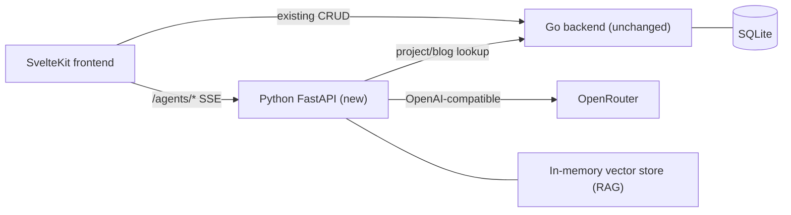

# Portfolio Revamp + Oracles

Working document tracking the multi-phase plan to evolve the Legacy Folio
portfolio and add four agentic bots ("The Oracles") that showcase applied
AI engineering.

- **Branch:** `feat/portfolio-revamp-oracles`
- **Status:** Phase 0, 1, and 3 complete. Phase 2 (Tour Guide + Clause
  Explainer) is the next milestone.
- **Commit history on this branch:**
  - `2a1ae70` &mdash; *Revamp portfolio UI and scaffold Oracles agentic bots* (Phase 0 + Phase 3)
  - `9449a07` &mdash; *Add docs for revamp* (first version of this document)
  - `0cef75c` &mdash; *Modernize home into refined editorial broadsheet*
  - `81b7b88` &mdash; *Merge feat/home-editorial-modernize: refined editorial home revamp*
  - upcoming &mdash; Phase 1 implementation (Concierge + Patent Bench)

---

## Goals

- Evolve, not replace, the "Legacy Folio" classical aesthetic (mahogany /
  parchment / brass, Playfair Display + PT Serif).
- Introduce a new section, "The Oracles" &mdash; agentic bots styled as
  illuminated counsel inside the archive.
- Showcase AI engineering: streaming, tool use, RAG, multi-agent
  orchestration &mdash; via a new Python FastAPI sidecar using OpenRouter.

---

## Final architecture



Top-level layout:

```
portfolio/
  frontend/   SvelteKit + Tailwind
  backend/    Go + Gorilla + SQLite (existing)
  agents/     Python FastAPI sidecar (new)
```

---

## The four Oracles

| #   | Name                       | Discipline                | Status     | Demonstrates                                          |
| --- | -------------------------- | ------------------------- | ---------- | ----------------------------------------------------- |
| I   | Portfolio Concierge        | Retrieval-Augmented       | In Session | sentence-transformers RAG over resume/projects/blog   |
| II  | Patent Compliance Bench    | Multi-agent (LangGraph)   | In Session | Drafter -> Reviewer -> Revisor with critique loop     |
| III | Project Tour Guide         | Tool-using agent          | In Chambers| OpenRouter tool-calling against the Go backend        |
| IV  | Clause Explainer           | Structured JSON output    | In Chambers| Pydantic-validated single-shot generation             |

Visitor sessions are in-memory only (no login, no DB persistence). Each bot
page includes sample prompts or sample inputs; the Patent bot shows a
privacy banner: do not paste real confidential drafts.

---

## Phasing and status

### Phase 0 &mdash; Foundations (DONE)

- [x] **phase0_resume_extract** &mdash; Extract resume from `+page.svelte` into
  [frontend/src/lib/content/resume.ts](../frontend/src/lib/content/resume.ts);
  add Go `GET /api/resume` handler at
  [backend/internal/api/resume.go](../backend/internal/api/resume.go) reading
  [backend/data/resume.json](../backend/data/resume.json).
- [x] **phase0_agents_scaffold** &mdash; Python FastAPI service in `agents/`
  with OpenRouter client, SSE helpers, session store, rate limiter,
  Dockerfile, docker-compose entry, `.env.example`.
- [x] **phase0_frontend_scaffold** &mdash; Shared `OracleChat` +
  `ToolCallTrace` components, `/oracles` landing page, Navbar entry,
  oracle CSS utilities in `app.css`.

### Phase 1 &mdash; Two flagship bots (DONE)

- [x] **phase1_concierge** &mdash; Portfolio Concierge: local
  `sentence-transformers` RAG index over resume/projects/blog,
  `POST /agents/concierge/chat` SSE endpoint, citation UI.
- [x] **phase1_patent_multiagent** &mdash; Patent Compliance multi-agent
  (LangGraph: drafter -> reviewer -> revisor) with structured
  `ComplianceReport` pydantic model, `POST /agents/patent/run` SSE endpoint,
  three-panel UI with timeline + memorandum + sample drafts + disclaimer.

### Phase 2 &mdash; Remaining two bots (NEXT)

- [ ] **phase2_tour_guide** &mdash; Project Tour Guide: tool-using agent
  with `get_project` + `list_related_blog` tools,
  `POST /agents/tour/chat` endpoint, "Ask the Tour Guide" button on
  project detail pages.
- [ ] **phase2_clause_explainer** &mdash; Legal Clause Explainer:
  `POST /agents/clause/explain` single-shot structured output,
  `ClauseExplanation` pydantic, two-pane "Memorandum of Counsel" UI.

### Phase 3 &mdash; Revamp polish (DONE)

- [x] **phase3_polish** &mdash; Rework Home hero + Counsel Chamber section;
  motion pass (page-turn, ink-bloom, typewriter, reduced-motion);
  typography pass; refreshed About copy.
- [x] **phase3_audit_readme** &mdash; Update [README.md](../README.md) with
  new architecture, agents env vars, and run steps.

The home page was subsequently elevated further in a separate merge
(commits `0cef75c` / `81b7b88`) into a refined editorial broadsheet with a
masthead, dropcap statement, hairline rules, and a featured Oracle I card.

---

## What was shipped

### Frontend
- [frontend/src/lib/content/resume.ts](../frontend/src/lib/content/resume.ts) &mdash; typed single source of truth for the resume.
- [frontend/src/lib/api/agents.ts](../frontend/src/lib/api/agents.ts) &mdash; typed POST-SSE client with persistent session id, robust CRLF/LF event framing, and `explainClause` helper.
- [frontend/src/lib/components/oracle/OracleChat.svelte](../frontend/src/lib/components/oracle/OracleChat.svelte) &mdash; reusable streaming chat panel.
- [frontend/src/lib/components/oracle/ToolCallTrace.svelte](../frontend/src/lib/components/oracle/ToolCallTrace.svelte) &mdash; collapsible tool invocation trace.
- [frontend/src/routes/oracles/+page.svelte](../frontend/src/routes/oracles/+page.svelte) &mdash; The Oracles chamber landing page, with per-card status ("In Session" vs "In Chambers") and deep links.
- [frontend/src/routes/oracles/concierge/+page.svelte](../frontend/src/routes/oracles/concierge/+page.svelte) &mdash; Concierge chat page with method sidebar and suggested prompts.
- [frontend/src/routes/oracles/patent/+page.svelte](../frontend/src/routes/oracles/patent/+page.svelte) &mdash; Patent bench three-panel UI (Exhibit A / Proceedings / Memorandum) with three pre-loaded sample drafts and a disclaimer banner.
- [frontend/src/routes/+page.svelte](../frontend/src/routes/+page.svelte) &mdash; Editorial home page (masthead, Articles I-IV, Counsel Chamber with featured Oracle I).
- [frontend/src/lib/components/Navbar.svelte](../frontend/src/lib/components/Navbar.svelte) &mdash; "Oracles" nav entry.
- [frontend/src/app.css](../frontend/src/app.css) &mdash; oracle utilities (`btn-illuminated`, `oracle-illumination`, `ink-bloom`, `typewriter-cursor`, `telegraph-wire`, `page-enter`) + brass nav underline animation + `prefers-reduced-motion` guard.
- [frontend/src/routes/+layout.svelte](../frontend/src/routes/+layout.svelte) &mdash; route-keyed `page-enter` animation + mouse-tracking for `ink-bloom` hover.

### Backend (Go)
- [backend/internal/api/resume.go](../backend/internal/api/resume.go) &mdash; public `GET /api/resume` handler.
- [backend/data/resume.json](../backend/data/resume.json) &mdash; canonical resume served to the agents sidecar.
- [backend/cmd/server/main.go](../backend/cmd/server/main.go) &mdash; route wired.
- [backend/Dockerfile](../backend/Dockerfile) &mdash; copies the `data/` directory.

### Agents sidecar (Python)
- [agents/app/main.py](../agents/app/main.py) &mdash; FastAPI app, CORS, rate-limit middleware, lifespan hook that warms the Concierge RAG index.
- [agents/app/llm.py](../agents/app/llm.py) &mdash; singleton OpenRouter client (`openai` SDK), `stream_chat` (yields `StreamEvent`s with tokens + tool calls), `complete_json` for structured output.
- [agents/app/sessions.py](../agents/app/sessions.py) &mdash; in-memory session store with TTL.
- [agents/app/sse.py](../agents/app/sse.py) &mdash; SSE event encoder.
- [agents/app/rate_limit.py](../agents/app/rate_limit.py) &mdash; sliding-window per-IP limiter.
- [agents/app/settings.py](../agents/app/settings.py) &mdash; typed `pydantic-settings`.
- [agents/app/rag/corpus.py](../agents/app/rag/corpus.py) &mdash; pulls resume/projects/blog from the Go backend and chunks them with citation metadata.
- [agents/app/rag/index.py](../agents/app/rag/index.py) &mdash; lazy-loaded `sentence-transformers` model + in-memory cosine-similarity index.
- [agents/app/routes/concierge.py](../agents/app/routes/concierge.py) &mdash; `POST /agents/concierge/chat` SSE endpoint that retrieves top-k chunks, emits `citation` events, then streams grounded LLM tokens.
- [agents/app/schemas/patent.py](../agents/app/schemas/patent.py) &mdash; `PatentSections`, `Finding`, `ComplianceReport`, `RevisionResult` pydantic models.
- [agents/app/graphs/patent.py](../agents/app/graphs/patent.py) &mdash; LangGraph workflow (`drafter -> reviewer -> conditional(any HIGH and iter<1) -> revisor -> reviewer -> END`) with per-node summary helpers.
- [agents/app/routes/patent.py](../agents/app/routes/patent.py) &mdash; `POST /agents/patent/run` SSE endpoint that streams `state` events on each node transition and a final `report` event with the structured payload.
- [agents/app/routes/tour.py](../agents/app/routes/tour.py), [agents/app/routes/clause.py](../agents/app/routes/clause.py) &mdash; status stubs awaiting Phase 2 implementation.
- [agents/Dockerfile](../agents/Dockerfile) &mdash; pre-downloads the sentence-transformers embedding model at build time.
- [docker-compose.yml](../docker-compose.yml) &mdash; `agents` service sources secrets from `agents/.env.local` (gitignored) and overrides container-specific env (`BACKEND_URL`, `PORT`).

### Docs
- [README.md](../README.md) &mdash; new architecture, agents env vars, run steps.
- [agents/README.md](../agents/README.md) &mdash; service-local quickstart.

---

## Verification at last commit time

- `cd frontend && npm run check` &mdash; 0 errors.
- `cd frontend && npm run build` &mdash; production build succeeded.
- Agents OpenAPI introspection lists all five endpoints (`POST /agents/concierge/chat`, `POST /agents/patent/run`, and four `*/status` routes).
- `from app.graphs.patent import get_graph` compiles the LangGraph cleanly with nodes `__start__`, `drafter`, `reviewer`, `revisor`, `__end__`.
- `ReadLints` across modified Go/TS/Python files &mdash; clean.

---

## Local test recipe

```powershell
# Terminal 1: Go backend
cd backend; go run cmd/server/main.go

# Terminal 2: Python sidecar (first run downloads ~120MB embedding model)
cd agents
.\.venv\Scripts\Activate.ps1
pip install -r requirements.txt
# Ensure agents/.env or agents/.env.local has OPENROUTER_API_KEY set.
uvicorn app.main:app --reload --port 8001

# Terminal 3: Frontend
cd frontend; npm run dev
# Visit http://localhost:5173/oracles
```

For Docker Compose end-to-end:

```powershell
# OPENROUTER_API_KEY must live in agents/.env.local (gitignored).
docker-compose up --build
```

---

## How to finish Phase 2

The Phase 1 work established conventions the remaining bots can reuse
verbatim:

1. **Tour Guide** &mdash; create `agents/app/tools/registry.py` with:
   - `get_project(slug)` &rarr; `GET {BACKEND_URL}/api/projects/slug/{slug}`
   - `list_related_blog(query)` &rarr; `GET {BACKEND_URL}/api/blog` plus
     simple keyword filtering.
   Implement an OpenRouter tool-calling loop in
   [agents/app/routes/tour.py](../agents/app/routes/tour.py) that:
   - Streams `token` events for the assistant message.
   - Emits `tool_call` and `tool_result` events around each tool invocation
     so [ToolCallTrace.svelte](../frontend/src/lib/components/oracle/ToolCallTrace.svelte)
     renders the wire.
   Front it with `OracleChat` at
   `frontend/src/routes/oracles/tour/+page.svelte`, accept `project_slug`
   as an optional `extraBody` parameter, and add an "Ask the Tour Guide"
   button to the project detail pages.

2. **Clause Explainer** &mdash; create `agents/app/schemas/clause.py` with a
   pydantic `ClauseExplanation` matching the TypeScript interface already
   declared in
   [frontend/src/lib/api/agents.ts](../frontend/src/lib/api/agents.ts).
   Implement [agents/app/routes/clause.py](../agents/app/routes/clause.py)'s
   `POST /explain` as a single-shot `complete_json` against the smart
   model. Front it with a two-pane "Memorandum of Counsel" UI at
   `frontend/src/routes/oracles/clause/+page.svelte`.

When pulling these in, also:
- Flip the corresponding entries on the
  [Oracles landing page](../frontend/src/routes/oracles/+page.svelte) to
  `status: "ready"` and set their `href`.
- Update the home Counsel Chamber teasers in
  [+page.svelte](../frontend/src/routes/+page.svelte) to deep-link.

---

## Open assumptions still in force

- Provider: OpenRouter for all chat; embeddings local via
  `sentence-transformers` (free, no extra key, deployable).
- Model defaults (env): `OPENROUTER_MODEL_FAST=openai/gpt-4o-mini` for
  Concierge + Tour Guide; `OPENROUTER_MODEL_SMART=anthropic/claude-sonnet-4.5`
  for Patent + Clause.
- Sessions: in-memory, cookie-scoped, 1h idle TTL. No DB writes for
  visitor chats.
- Deployment: same host as the Go backend, with the Python sidecar as a
  second process / service. Local dev via the extended
  [docker-compose.yml](../docker-compose.yml).
- Cost guardrails: per-IP rate limit (default 20 messages/minute) in the
  Python service.
